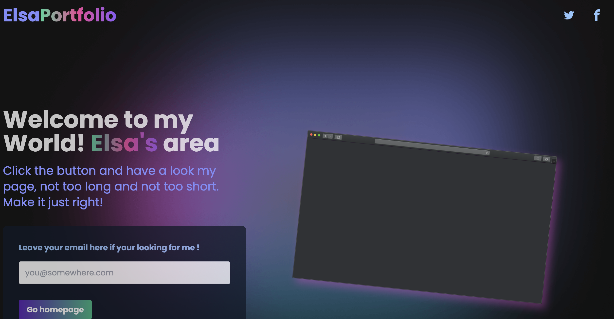
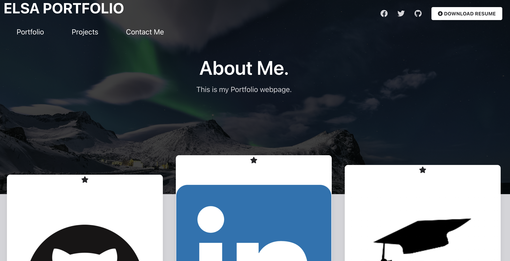

# Portfolio2

This is the detail for week8-homework PORTFOLIO.

* Create a new repository on my Github account and creat a README.md file.
* Make sure the code meets the requirements.
* Always checking the result in webpage.
* Write the code in vs Code and upload it by gitpush.
* Update the code to the repo.
* Create a webpage link at github in setting

## Technologies used

* HTML
* JS
* TAILWIND

## License 

* MIT

## Demo

## Website URL

[Protfolio 2](https://elsa5152.github.io/Portfolio2/)

## GitHub Link

[Link](https://github.com/elsa5152/Portfolio2)

## Contact

Elsa (elsa5152@github.com)